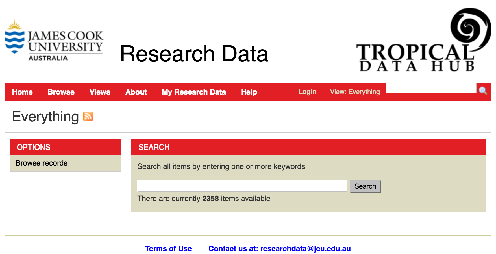

Accessing TDH Research Data
===========================

TDH Research Data is publicly accessible and can be found at http://research.jcu.edu.au/researchdata.

When you first go to the site, you are able to search/browse the published contents of the site.

Browsing records
----------------

Clicking on "Browse records" in the Options menu will take you to a listing of all the records
in the site. On the left-hand side of the screen, you will see a number of menus - Stage,
Source and Keyword - and in the main section of the screen is Results containing the list of
records.

The Stage menu gives the number of records in each stage of the workflow; as a non-logged
in user, you will only see the count of published records.

The Source menu gives counts of the records imported from different sources - typically
these are from applications that generate new datasets and automatically create metadata
records for them. You can click on any of the entries in the Source menu to return the list of
all records from that source.

The Keywords menu provides counts of records associated with the various keywords in the
system. Keywords include the Fields of Research codes, Socio-Economic Objectives and
any local keywords. Clicking on an entry in the menu will perform a search for records that
contain that keyword.

The Results section lists the results of the search that has been performed. Clicking on to
the title of the record you are interested in will take you to its Details page.

The Details page presents the metadata in the following sections:

  * General

    + Shows title, and creation and last modified dates for the metadata information.

  * Coverage

    + Gives information relating to the time period covered by the research data and
      the geospatial region relevant to the research data if applicable.

  * Description

    + Descriptions about what the research data is and how it was collected or generated.
      It may also let you know what format the data is in.
    + You may also find links to

      - publications
      - website
      - other datasets
      - services or
      - technical metadata

      that are related to the data.

  * People

    + Lists names and affiliations of the researchers involved in the creation of the dataset
    + Provides the name and contact details of the primary contact for the datasets.
    + Supervisors involved in the creation of the dataset
    + Lists any external collaborators.

  * Subject

    + This section contains the keywords relevant to the datasets. It contains the Fields
      of Research and Socio-Economic Objective codes as well as an local keywords.
    + In addition, the JCU Research Themes associated with the data are listed.

  * Rights

    + Provides information relating to the licensing, access conditions and any legal
      constraints on the use of the data.

  * Data

    + The data section provides information about where the data is stored and provides
      links to the data where it is available on line.

      .. image:: _static/Data-tab.png
         :width: 100%

  * Citation

    + Provides the citation metadata required for citing the dataset.
