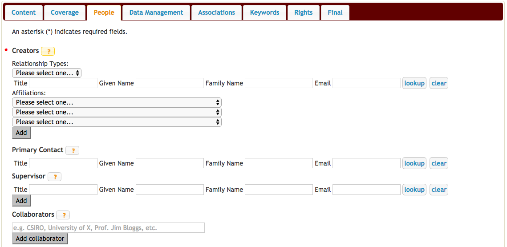
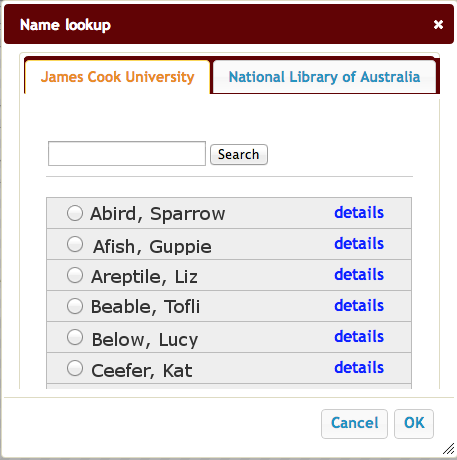
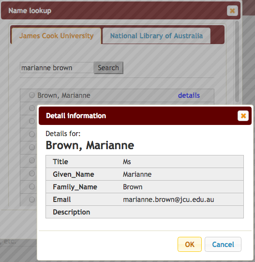
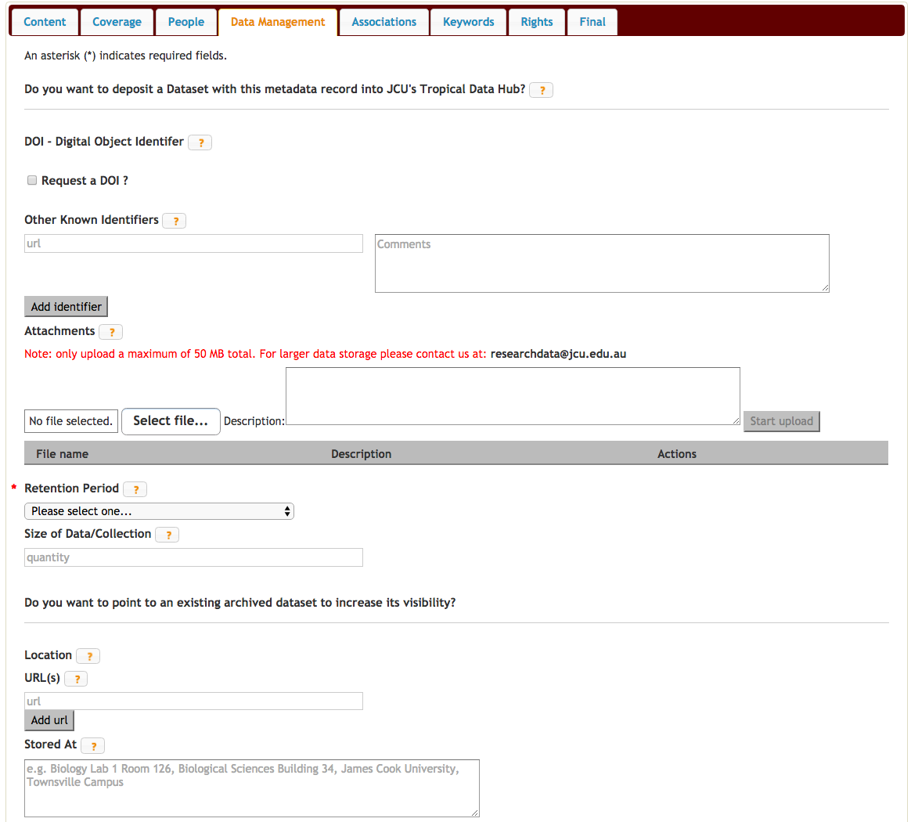
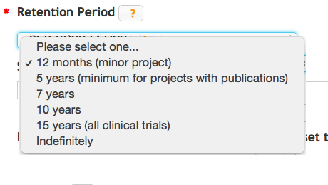
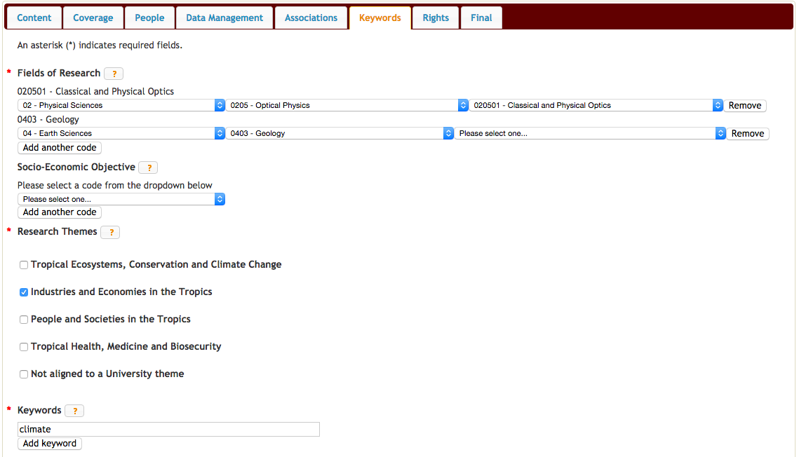
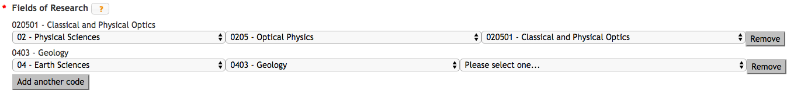
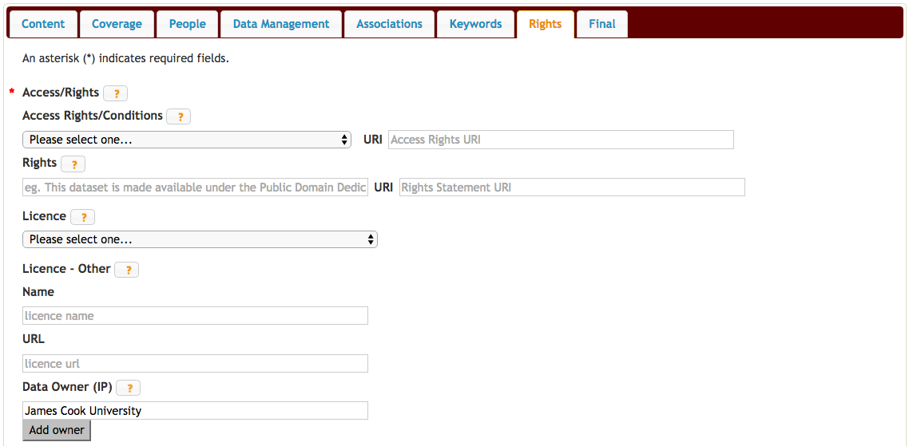

Adding a new Research Data Record
=================================

To add a new research record to Research Data, you need to access 'My Research Data'. You can access 'My Research Data' from the home page by clicking on 'My Research Data' in the menu bar or by going directly to http://research.jcu.edu.au/researchdata/dashboard. If you are not already logged into the site, the login box will appear at this point.

Logging In
----------

.. figure:: _static/Login-Dialog.png
   :width: 100%
   :figwidth: 50%
   :figclass: float-right

   Click on the orange AAF logo to log in to the site

JCU staff and students can authenticate to the site via the Australian Access Federation login.

.. raw:: html

   <div style="clear: both" ></div>

.. figure:: _static/AAF-Select-Institution.png
   :width: 100%
   :figwidth: 50%
   :figclass: float-right

   Pick your institution from the list. You can check the second tick box to
   remember this setting from now on.

You will need to specify James Cook University as your institution

.. raw:: html

   <div style="clear: both" ></div>

.. figure:: _static/JCU-CAS-login.png
   :width: 100%
   :figwidth: 50%
   :figclass: float-right

   Log in with your normal JCU username and password

Then authenticate at the normal JCU login page. Once you have logged in you will be returned to the dashboard.

.. raw:: html

   <div style="clear: both" ></div>

Creating a new JCU Research Record
----------------------------------

'My Research Data' provides you with the facility to create a research record. A research record contains information about your research data:

* Who collected the data
* Why it was collected
* Where and when it was collected
* What publications or other research outputs are related to your data
* How your data can be accessed and how it should be cited.

To create a new research record, click on “Add a new JCU Research Record”.

.. figure:: _static/researcher-dashboard.png
   :width: 100%
   :figwidth: 100%


The web form for a new research record consists of 8 tabs. You can save and close
the form at any stage provided you have completed the required fields on the
open tab. Required fields are marked by an asterisk (*). For example, the
Content tab shown below has Title, Descriptions, and Collection Type as
required fields. Provide these have some data in them, you could save the form
at this point without completing any of the other tabs.

.. figure:: _static/New-dataset-form.png
   :width: 100%
   :figwidth: 100%

Help for each field can be viewed by clicking on the orange question mark |help-icon|.

.. |help-icon| image:: _static/Help-icon.png

The Content tab
---------------

This section of the form contains three fields - all of which are required:

Title
`````

Remember, the title will be what appears in any citation of your dataset -
`Fred's Dataset` is not ideal.
Titles should be as descriptive as possible. They should include keywords to
provide context for non-specialist users, as well as information such as the
nature of the data and spatial and temporal coverage.  For example, a
collection named "Pilbara" may be adequate in the context of a particular
discipline database, but not in a repository that contains multiple discipline
outputs.  It would be more informative to provide a name like
`Western Australian Geological Survey: Pilbara` or
`Aboriginal Art Collection: Pilbara, 1950-1965`.  Research record titles
should be unique and generally should not use
acronyms.

Descriptions
````````````

.. important::
   The description is the **most** important part of your data record. It
   should be informative to other researchers and answer the what, why, and how
   questions relating to your data and your research. When your record is
   reviewed, if it is decided that your description is insufficient, you
   **will** be contacted for more information and your record will **not** be
   published until a more complete description is provided.


Ideally, you should provide at least two descriptions: a `brief` description and a `full` description. Select the type of description you are adding from the **Type** drop down and provide the text in the **Description** box. To add another description, use the **Add description** button. Once more than one description is present, a **Remove** button appears at the end of each description allowing you to delete an entry.

Possible description types are:

**Brief**
  The brief description should be one or two sentences that describe the dataset in a manner understandable to the lay-person.
**Full**
  Include a description of the kind of data in the dataset, **how** it was
  collected or analysed, **what** the dataset consists of (in some detail) and **why** the data was collected to provide context to your data.
  Remember describe the *dataset* not the overall project or the publication.
**Note**
  The note type can be used to include additional information such as

  * the size of the data download,
  * the different file formats used in the dataset
  * acknowledgements of funding bodies

**Logo**
   If your dataset is associated with a project or organisation with a logo
   that you would like displayed on the dataset's page when it is displayed in
   Research Data Australia, you can include the url to the logo in this type.

.. figure:: _static/Description-widget.png
   :width: 100%
   :figwidth: 100%


Collection Type
```````````````

Research data collections can be classified as a

* Catalogue or Index
* Collection
* Dataset
* Registry
* Repository

.. figure:: _static/cpgdectree.png
   :width: 100%
   :figwidth: 100%

   Decision tree to help determine the type of Research data collection you have.
   Image curtesy of Australian National Data Service (http://ands.org.au).


Coverage
--------
The Coverage tab contains metadata that specifies the time span and location relevant to your data.

Date Coverage
`````````````
The date coverage allows you to specify the time period relevant to your date - this could be a start and end date for the data collection or it could be a time period such as *World War II* or *The Dark Ages*. For example, if your research data relates to samples you have collected and analysed (e.g. temperature readings, soil pH, blood tests, biological samples) then the date coverage would be:

* start of data collection - 1st of October 2011 e.g. 2011-10-01
* end of data analysis - 30th of November 2013 e.g. 2013-11-30

In this case you would use the date picker widgets to enter in these exact dates in the **From:** and **To:** fields and you would leave the **Time Period** text field empty.


   When exact dates are relevant to the research dataset being described, use the From and To fields.

If your research was an analysis of the 1920s fashion then, rather than the dates you collected your material, the relevant time period would be "The 1920s" and you would leave the **From:** and **To:** fields empty and enter "The 1920s" into the **Time Period** field.


   When a phrase describing the time period being considered is more appropriate than exact dates, use the Time Period field.

So - use either the **From:** and **To:** fields *or*  the **Time Period** field but not both!

Hints
~~~~~

1. You can type your date into the **From:** and **To:** fields rather than
   using the date picker widget if you prefer. Just ensure you use the
   YYYY-MM-DD or YYYY format.
2. Not all research data collections have a
   start and end date. It may be that the research is ongoing and so you
   only have a start date. In this case, leave the **To:** field empty.

Geospatial Location
````````````````````

The Geospatial location is used to describe the region on Earth that is
relevant to the research data. This is an optional field as not all datasets
have a geospatial location. If this field is relevant to your research, there are three formats for adding geospatial data:

1. Provide a text description of the location - e.g. *30km SW of Port Douglas, Queensland, Australia*.
2. Provide the ISO 3166-1 code for a country (http://www.iso.org/iso/home/standards/country_codes/iso-3166-1_decoding_table.htm).
3. Use the map widget to locate the area of interest and use the drawing tools to show the locations.

Multiple geospatial locations can be provided for a single research record and any of the above methods can be used.


Adding a text description of country code can be achieved by using the Location Type and Value field - these can be seen below the map widget.


Using the map widget
~~~~~~~~~~~~~~~~~~~~

The table below explains the different tools available in the map and how to use them.

+--------------+---------------------+-------------------------------------------+
| Icon         |  Action             | Explanation                               |
+==============+=====================+===========================================+
| |drag|       | Drag map            | Click and hold the left mouse             |
|              |                     | button key to drag the map.               |
|              |                     | You can also click and hold               |
|              |                     | the right mouse button to select          |
|              |                     | an area and the map will zoom and         |
|              |                     | centre the map over the selected area.    |
+--------------+---------------------+-------------------------------------------+
| |point|      | Add a point         | Click on the map with the left mouse      |
|              |                     | button to add a point.                    |
+--------------+---------------------+-------------------------------------------+
| |bbox|       | Add an area using a | Click and hold the left mouse and         |
|              | bounding box        | drag to the size wanted. Release the      |
|              |                     | mouse button to finish the box.           |
+--------------+---------------------+-------------------------------------------+
| |polygon|    | Add a polygon       | Click the left mouse to start the         |
|              |                     | shape. Click as many points as needed     |
|              |                     | and double click on the last point to     |
|              |                     | close the shape.                          |
+--------------+---------------------+-------------------------------------------+
| |linestring| | Add an open shape   | Click the left mouse to start the         |
|              |                     | shape. Click as many points as needed     |
|              |                     | and double click on the last point        |
|              |                     | finish the shape.                         |
+--------------+---------------------+-------------------------------------------+
| |circle|     | Draw a circle       | Click (on the location you want to        |
|              |                     | have as the centre of the circle) and     |
|              |                     | hold the left mouse button and drag to    |
|              |                     | the desired size. Release the mouse button|
+--------------+---------------------+-------------------------------------------+
| |edit|       | Edit the map        | Click on/inside the shape you want to     |
|              |                     | edit - it will turn blue. To move the     |
|              |                     | shape as a whole click and hold on the    |
|              |                     | centre point for the shape and drag to    |
|              |                     | the desired location. To move a single    |
|              |                     | vertice, click and drag it to the new     |
|              |                     | location.                                 |
+--------------+---------------------+-------------------------------------------+


.. |drag| image:: _static/map-drag.png


As you add items to the map, entries will appear in the (Location Type, Value) area below the map.


   When you add a shape to the map, a **Location Type** of *free text* is added with a **Value** of *POLYGON(....)*.

To edit the shape, select the |edit| icon and click on the shape you wish to edit.

Another way to edit the shape is to click on the edit icon for the location (left of the trash can). This will automatically select the shape and zoom it to fix the window. Alter the shape by dragging the points as required. This will automatically update the points for the location.


People
------



The People tab has three (3) sections:

 * Creators ( *required* )
 * Primary Contact
 * Collaborators

Creators
````````

The Creators section is used to add JCU researchers who have contributed to the creation of the dataset. They may be data collectors, people who have helped clean the data or people who have contributed to make the data set better.

Adding a person's details to this section can only be done using the **lookup** facility. Clicking on **lookup** will open a *Name lookup* box. By default the *James Cook University* tab will be showing - this searches the JCU researcher database.



    When on the Mint tab, the search is performed against the JCU researcher database.

If your search returns more than one person with the same name, you can click on the *details* link to view the details and check the email address to determine which is the person you were looking for.




Once you have selected the right person, check the box next to their name and hit *OK*. The person's details will now be added to the Creators section. In addition to completing the title, names and email fields, the Affiliations will also be completed with up to three internal JCU units. Unlike the title, name and email fields, the affiliations can be adjusted - just select your preferred unit from the drop down list. To unset an affiliation just set the affiliation to the default "Please select one..."

To add additional people, use the **Add** button found under the set of three affiliations.

Primary Contact
```````````````

The *Primary Contact* fields can completed using the *lookup* or by manual entry. This is particularly useful for PhD students who may be leaving JCU but still wish to be the primary contact for their dataset. It can also be used by JCU staff who wish all enquires to be directed to a central email address, e.g. the school's contact email address, rather than their personal work email address.

Collaborators
`````````````

The *Collaborators* section allows you to credit people and organisations outside JCU that contributed to the data. Please add a new line for each collaborator and include name, affiliations and possibly contact information is appropriate.


Data Management
---------------

The *Data Management* tab contains information relating to
 * requesting a Digital Object Identifier  - *Request a DOI ?*
 * other identifiers used to identify the dataset - *Other Known Identifiers*
 * attaching files of up to 50 MB in total size - *Attachments*
 * how long the data should be kept for - *Retention Period*
 * size of the data - *Size of Data/Collection*
 * where the data lives - *Location*



Request a DOI ?
```````````````

A DOI provides you with a unique string to identify content and to provide a persistent link to its location on the internet. e.g. "10.4225/28/570F29840516A" To use the DOI in a url enter "http://dx.doi.org/" followed by the DOI in a browser. e.g. "http://dx.doi.org/10.4225/28/570F29840516A"

Other Know Identifiers ?
````````````````````````

You may have already published your data on a website with your publication. Adding the URL to this location can help to increase the exposure of your dataset.

Attachments
```````````

Use to attach your datasets up to a total size of 50 MB. Click on the 'Select file...' button, browse for you file and click 'Start Upload'. Multiple files can be uploaded.

.. note:: This assumes your data will be made public. After submitting your record, it will be reviewed. If you indicate on the 'Rights' tab that access is restricted or private, the attached files will be stored in a private section of the 'Tropical Data Hub' where there is no public access. They will then be removed from this record. You will be contacted by a Digital Librarian to discuss this.

Retention Period
````````````````



Where possible, in general the intention is to retain research data for as long as feasible. The Code for the Responsible Conduct of Research recommends some minimum retention periods. Please choose from the drop down list the period that you believe to be most applicable for a minimum retention period.

Size of Data/Collection
```````````````````````

For electronic data, please provide the size of the data you want associated with this metadata record. This will be useful for people wanting to download your data and for the repository manager who may need to find storage to accommodate your collection.

For physical data, provide a weight and/or volume or other information (e.g. count) that you think relevant.

Location
````````

There are two options in the *Location* section; you can provide one or more *URL(s)* if your data already has a home that is accessible via the web, or you can provide an address or other information in the *Stored At* text box if your data has a physical location. For example, your data may be a collection of physical items located in a storage room at your place of work.

.. note:: Please use the text box if your data doesn't have a permanent home and you need assistance with finding a suitable storage locations. For example, it may be you have your data stored on USB drives and you need assistance moving your data to a better long term home. Put this information in the *Stored At* text box and someone will contact you once your record has been submitted.


Associations
------------

The *Associations* tab allows you to link to your dataset information about grants, publications, websites and other related datasets and services that have an association with your data.


Grants
``````

The *Grants* section is connected to RIMS (the Research Information Management System) that contains all the grants that have been processed through the Research Services office. You can search by the internal grant ID or by the title. To perform a search, type either the number or a part of the title in the **Number** box.

.. hint:: If you are unsure of the title for a grant title, try searching the Research Portfolio (http://jcu.me) page of one of the investigating researchers. Alternatively, talk to Research Services or the eResearch Centre for assistance.


    Type either the start of the grant number or some key words from the title in the *Number* box and the system will return a list of matching records from the grants database.

The search returns a list of matches - this box is scrollable and the records are presented in alphabetical order by title.


    Once the chosen record is selected from the list, the grant number and title fields will be completed.

Related Publications
````````````````````

To help ensure people who have found your dataset also find the associated research, please provide the *URL* to any publications that have a relationship to the data. It may be the URL to the entry in `ResearchOnline@JCU`_ or the URL based on a doi (e.g. http://dx.doi.org/xxxxxx)

.. _`ResearchOnline@JCU`: http://researchonline.jcu.edu.au

The *Title* field is self-explanatory but some researchers prefer to put the citation text in the *Title* field - this is fine. The *Notes* field can be left blank, used to provide information about the publication (e.g. PhD Thesis) or can be used to explain the relationship between the data and the publication.

If a publication is pending and you don't have a URL to link to yet, provide what information you have and you can email researchdata@jcu.edu.au with the URL when you have that information and we will add it to your record.

Related Websites
````````````````

You might want to link back to a project site or your research group's website. Provide the *URL* and the page title in the fields provided. The *Notes* field can be used to explain the relationship between the data and the website.

Related Data
````````````
Is your data generated from another dataset you used as input? Is your dataset a refinement of an earlier dataset? Is your dataset a small part of some larger collection? Whatever the situation, if your data has a link/relationship to another dataset and you know the identifier for that dataset, you can make a note of that relationship here.

Why would you want to do this? When the data record is imported into ANDS, the system will cross link your dataset with its related datasets - thus increasing the number of ways someone can discover your dataset.

To create the relationship, pick a relationship that best describes the nature on the link between the datasets (e.g. this new dataset is part of this other dataset and here is its identifier).

Related Services
````````````````
Services refers to research infrastructure that may have been used in the collection/generation of the research data. For example, you may have used the James Kirby research vessel to get to a dive site or an election microscope from the Advanced Analytical Centre or even some software tool developed at JCU, like CliMAS. All of these are classified as a Service and you should link to them if you have made use of them. All/most research infrastructure at JCU is listed in the JCU NameAuthority and this can be searched by typing a keyword in to the *Title* field.

If you have used research infrastructure from another university, if you can find the identifier and title for that service you can add them in here.


Keywords
--------

This section of the form collects Fields of Research (FoR) and Socio-Economic Objective (SEO) codes, JCU Research Themes and any keywords you would like associated with your research. Keywords, FoR and SEO codes are key search terms used by the various portals that store the research records.




Fields of Research
``````````````````
You are required to select at least one FoR code, preferably a six-digit code though it is possible to select a two or four digit code.

To select a code, pick from the first drop down list to select the two digit Division code. This will trigger the loading of the next drop down list with the four digit group codes. Selecting a group code will trigger the loading of the six-digit field codes.

.. note:: If you stop at any point in this process and the FoR will be set at the last level completed.



  Add as many FoR codes as you think are appropriate. You are required to add at least one. In this example, there is a six-digit group code and a four-digit field code.

Socio-Economic Objectives
`````````````````````````
The SEO selector works in a the same manner as the FoR codes. The key difference being that the SEO codes are optional.

Research Themes
```````````````
This field is used for internal reporting and is mandatory. Select any of the JCU Tropical Research Themes that apply.

Keywords
````````
Enter the keywords or phrases that you think people would search on that relate to your dataset. One word or phrase per line.

Rights
------
The Rights section lets people know if they can access your data and the conditions associated with that access. Where JCU is the data owner, it is desirable to make the data as open as possible.



Access/Rights
`````````````
The *Access/Rights* section contains two fields: *Access Rights/Conditions* and *Right*. At least one of these two fields must be completed.

Access Rights/Conditions
~~~~~~~~~~~~~~~~~~~~~~~~
This field explains how people can access your data. A drop down list of the most common access conditions is provided but if none of these seem to fit your situation, selecting *Other* will open a new text field for you to enter a custom statement.


Rights
~~~~~~
This field should be used if your research funding contract contains any statement about the rights to the data. For example, an industry funder might retain joint IP rights or even usage rights on the data collected during the project. If the rights statement is long and you would like it to be displayed in full, email researchdata@jcu.edu.au and we can look at creating a webpage for the rights statement that you can link to in the *URI* field.

Licence
```````
The preferred licence for JCU research data is the Creative Commons - Attribution, Non-Commercial (CC-BY-NC), but you can apply any of the listed licences. For more information on the available licences see:
 * `Creative Commons AU licences <http://creativecommons.org.au/learn/licences>`_
 * `Open Data Commons Attribution licence <http://opendatacommons.org/licenses/by/summary/>`_
 * `Open Data Commons Open Database Licence <http://opendatacommons.org/licenses/odbl/summary/>`_
 * `Open Data Commons Public Domain Dedication and Licence <http://opendatacommons.org/licenses/odbl/summary/>`_

All these licences are open data licences. The Creative Commons licences are recommended for use by the `Australian Governments Open Access and Licensing Framework (AusGOAL) <http://www.ausgoal.gov.au>`_ but the others are provided for completeness. For more information about data licencing, see:
 * `Copyright, Data and Licensing <http://ands.org.au/guides/copyright-and-data-awareness.html>`_
 * `AusGOAL - Research Data FAQs <http://www.ausgoal.gov.au/research-data-faqs>`_

To set a licence, select a licence from the list and a brief statement showing a summary of the licence details is shown.


  If you click on the help button, the help text that appears contains a link to the Creative Commons licence webpage so you can quickly double check the details on the licences.

Licence - Other
```````````````
In the event that you have constraints on your data set that need to be fulfilled before sharing of data can take place then the AusGOAL framework provides a Restricted Licence template that can be used to specify the restrictions and/or additional conditions that need to be complied with. This will then need to go to the University Legal unit for checking. After this process, the licence can be attached to the Research Data record.

Data Owner (IP)
```````````````

By default, this is pre-filled with *James Cook University*. For students, depending on how your PhD has been funded, it may be that you are the data owner. If the data collection was part of an externally funded activity, you may need to check the contract to see if your funder has made claims to the data. If you are a staff member and the data has been collected as part of the research you have undertaken as part of your employment at JCU, then *James Cook University* is the data owner. In the case where there is joint data ownership, use the **Add owner** button to add additonal lines and enter one owner per line.


