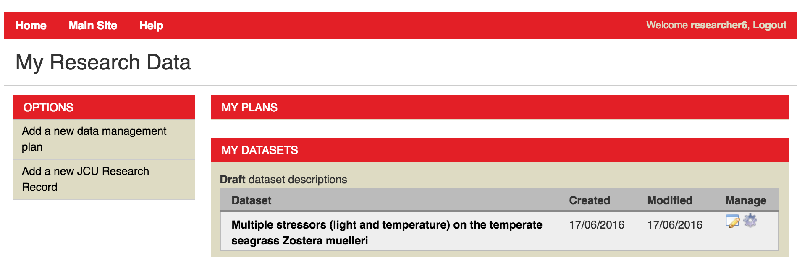
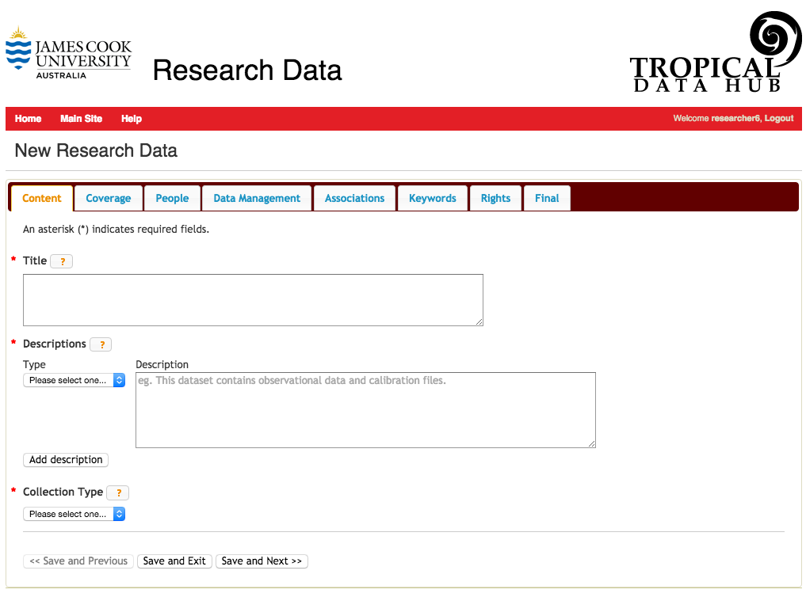
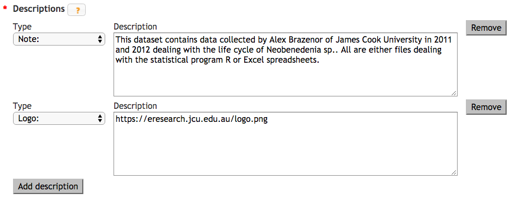

Adding a new Research Data Record
=================================

To add a new research record to Research Data, you need to access the Dashboard. You can 
access the Dashboard from the home page by clicking on Dashboard in the menu bar or be 
going directly to http://research.jcu.edu.au/researchdata/dashboard. If you are not already
logged into the site, the login box will appear at this point.


Logging In
----------


   
   Click on the orange AAF logo to log in to the site

JCU staff and students can authenticate to the site via the Australian Access Federation 
login.

.. raw:: html

   <div style="clear: both" ></div>


   Pick your institution from the list. You can check the second tick box to remember this 
   setting from now on.

You will need to specify James Cook University as your institution

.. raw:: html
   
   <div style="clear: both" ></div>


   Log in with your normal JCU username and password

Then authenticate at the normal JCU login page. Once you have logged in you will be 
returned to the dashboard.

.. raw:: html
   
   <div style="clear: both" ></div>

Creating a new JCU Research Record
----------------------------------

The Researcher Dashboard provides you with the facility to create a research record. A research 
record contains information about your research data:

 * Who collected the data
 * Why it was collected
 * Where and when it was collected
 * What publications or other research outputs are related to your data
 * How your data can be accessed and how it should be cited.

To create a new research record, click on “Add a new JCU Research Record”.



The web form for a new research record consists of 8 tabs. You can save and close
the form at any stage provided you have completed the required fields on the
open tab. Require fields are marked by an asterisk (*). For example, the
Content tab shown above has Title, Descriptions, and Collection Type as
required fields. Provide these have some data in them, you could save the form
at this point without completing any of the other tabs.



Help for each field can be viewed by clicking on the orange question mark |help-icon|.


The Content tab
---------------

This section of the form contains three fields - all of which are required:

Title
`````

Remember, the title will be what appears in any citation of your dataset - 
`Fred's Dataset` is not ideal.
Titles should be as descriptive as possible. They should include keywords to
provide context for non-specialist users, as well as information such as the
nature of the data and spatial and temporal coverage.  For example, a
collection named "Pilbara" may be adequate in the context of a particular
discipline database, but not in a repository that contains multiple discipline
outputs.  It would be more informative to provide a name like `Western
Australian Geological Survey: Pilbara` or `Aboriginal Art Collection: Pilbara,
1950-1965`.  Research record titles should be unique and generally should not use
acronyms. 

Descriptions
````````````

Ideally, you should provide at least two descriptions: a `brief` description and a `full` description. Select the type of description you are adding from the **Type** drop down and provide the text in the **Description** box. To add another description, use the **Add description** button. Once more than one description is present, a **Remove** buttion appears at the end of each description allowing you to delete an entry.

Possible description types are:

**Brief**
  The brief description should be one or two sentences that describe the dataset in a manner understandable to the lay-person.
**Full**
  Include a description of the kind of data in the dataset, how it was
  collected or analysed as well as describing what the dataset is about.
  Remember describe the *dataset* not the overall project or the publication.
**Note**
  The note type can be used to include additional information such as 

     * the size of the data download,
     * the different file formats used in the dataset
     * acknowledgements of funding bodies

**Logo**
   If your dataset is associated with a project or organisation with a logo
   that you would like displayed  on the dataset's page when it is displayed in
   Research Data Australia, you can include the url to the logo in this type.



Collection Type
```````````````

Research data collections can be classified as a

 * Catalogue or Index
 * Collection
 * Registry
 * Repository
 * Dataset


   Decision tree to help determine the type of Research data collection you have.
   Image curtesy of Australian National Data Service (http://ands.org.au).


Coverage
--------
The Coverage tab contains metadata that specifies the time span and location relevant to your data.

Date Coverage
`````````````
The date coverage allows you to specify the time period relevant to your date - to could be a start and end date for the data collection or it could be a time period such as *World War II* or *The Dark Ages*. For example, if your research is 


